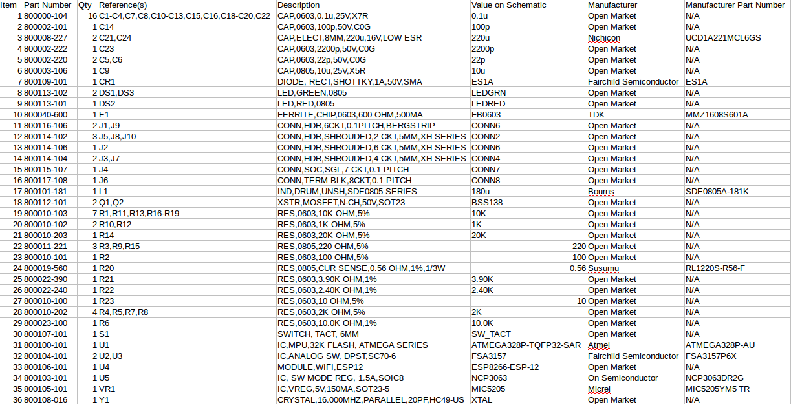

**BOMtools**
=========
This is a set of python scripts for managing and costing parts in a Kicad or Eagle 6 schematic 
(other schematic capture packages may be supported in the future). A costing script for
adding costing columns using the Octopart json API is also included.

*Introduction*

This set of python scripts allows you to define your own part numbers
which can then reference a title/description and optionally single
or multiple manufacturers and manufacturer's part numbers.

The project consists of a BOM manager script (bommgr.py) written in
Python 3, a BOM costing script written in python 3,
and separate merger scripts for
 
 * Kicad xml files written in Python 2.7.
 * Eagle 6 .csv files written in Python 3.0

*bommerge.py and bommerge-eagle.py* 

The merger script looks for a PartNumber field in the Kicad xml file
or Eagle 6 csv file, and opens the sqlite database to look up other
relevant fields based on the part number. It then generates an
output .csv file with all of the relevant fields included.

Before you run the merge script:

1. Assign part numbers with bommgr.py

2. For Kicad, you'll need to add a PartNumber field for each reference
designator on your schematic and include the new part number in
that field.

3. For Eagle, you'll need to add a PARTNUMBER attribute for each reference
designator on your schematic, bind the part numbers to the PARTNUMBER attribute
and check include attributes when exporting the .csv vile.

*bommgr.py*

Part numbers are expected to be in 6-3 format (e.g. 800000-101). You use
the manager script to add new part numbers like this:

bommgr.py add part "XSTR,NPN,GP,50V"

This will automatically assign a new part number and spit it out
when it has been added to the database.

The only requirement for part number assignment
is the title/description, but there are other options available to
customize the new part number in the database.

You can override the part number and assign a custom part number with
the --specpn option. This is good for inputting tabulated part numbers
(i.e. a series of connectors).

You can specify a manufacturer with the --mfg option and a
manufacturer's part number with the --mpn option. For new parts entered
without these options, the default values will be used:

"Open Market" for the manufacturer
"N/A" for the manufacturer's part number

Other command line options are available to get the next part number to
be assigned, modify a title, list all the parts or manufacturers, query
by part number or manufacturer.

Once all your parts are in the database, you can run the merge program
by calling it from Kicad, or externally on the Eagle .csv file

The output will look like this when imported into your spreadsheet:

Command Examples:

`bommgr.py list parts`

Lists all parts in the database

`bommgr.py list parts --like RES%`

List all parts with a Title/Description beginning with RES

`bommgr.py add part --specpn 800123-101 "SCREWDRIVER,LEFT HANDED"`

Add a part with a part number specified in advance

`bommgr.py add part --mfg ACME --mpn ANVIL-01 "ANVIL, 100KG"`

Add a part with a Manufacturer and Manufacturer Part Number

*bomcost.py*

The bomcost script takes the csv file from BOMmerge and uses the Octopart
API to add vendor and cost columns for every part match returned by Octopart.
It then spits out a new csv file with the additional columns. 

The bomcost script uses a section bommgr.conf to set approved vendors, excluded
packaging (Such as custom reels), and the currency to quote the parts
in. See the sample bommgr.conf for details. Here is a sample of the costed 
output imported into a spreadsheet:

*Installation*

The following python3 modules are required for bommgr.py:

* sqlite3
* argparse
* configparser

The following python2.7 modules are required for bommerge.py:

* kicad_netlist_reader
* csv
* sqlite3
* argparse
* ConfigParser

The following python3 files are required for bommerge-eagle.py

* argparse
* configparser
* csv
* sqlite3

The following python3 modules are required for bomcost.py:

* argparse
* configparser
* csv
* json
* urllib3
* urllib.parse
* decimal

When running the parts manager or the kicad merger, the database will
need to be created. A separate script, gendb.py in the bommgr
directory does this.

*Notice*

This is currently alpha software. There will most likely be bugs. This is not feature complete. There
are several important commands missing. There is no facility to delete part numbers once they have been
assigned, and there probably never will be as that is dangerous. 

Use at your own risk.

Feedback is appreciated.

